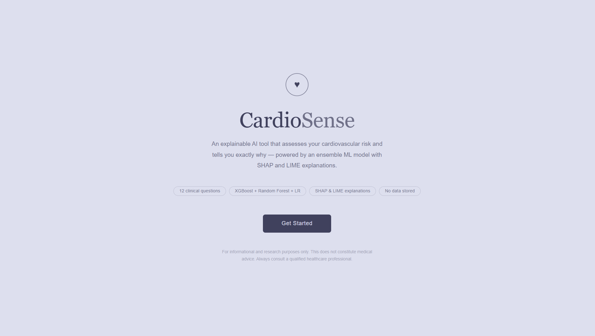
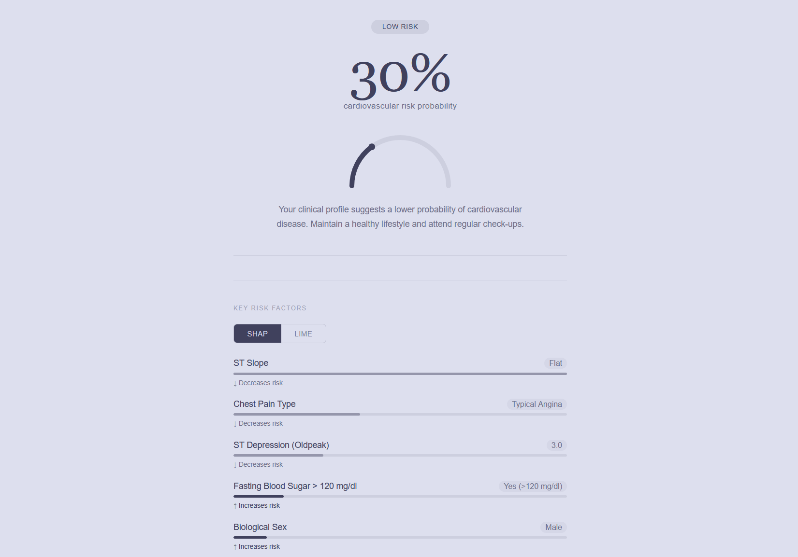
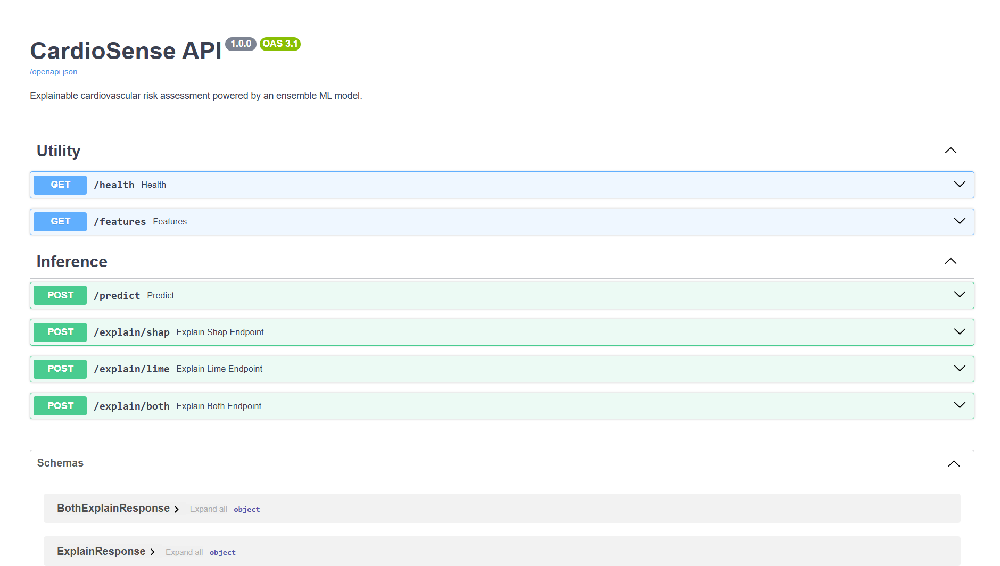

# CardioSense

**Explainable cardiovascular risk assessment powered by ensemble machine learning.**

CardioSense takes 12 clinical inputs, runs them through a soft-voting ensemble of XGBoost, Random Forest, and Logistic Regression, and returns a risk probability alongside SHAP and LIME explanations — so you always know *why* the model thinks what it thinks.

---

## Demo

> Start the API, open `cardiosense_local_api.html` in any browser, and answer 12 questions to get your risk report.

### Landing Page


### Risk Analysis & Explainability (SHAP/LIME)


### API Documentation (Swagger)



---

## Features

- **Ensemble model** - XGBoost + Random Forest + Logistic Regression with soft voting
- **Dual explainability** - SHAP (global fidelity) and LIME (local linear approximation) on every prediction
- **Zero-friction frontend** - single HTML file, no build step, no dependencies
- **FastAPI backend** - typed endpoints, automatic Swagger docs, CORS-ready
- **Auto-training** - model trains itself on first startup if no saved artifacts exist

---

## Project Structure

```
cardiosense/
├── Cardiovascular_Disease_Dataset.csv   - dataset
├── model.py                             - training, inference, SHAP, LIME
├── app.py                               - FastAPI backend
├── train.py                             - standalone training script
├── cardiosense_local_api.html           - frontend (open directly in browser)
├── requirements.txt
├── artifacts/                           - auto-created on first run
│   ├── ensemble_model.joblib
│   ├── scaler.joblib
│   └── metadata.joblib
└── README.md
```

---

## Quick Start

### 1. Clone and set up environment

```bash
git clone https://github.com/your-username/cardiosense.git
cd cardiosense

python -m venv venv
source venv/bin/activate        # Windows: venv\Scripts\activate
pip install -r requirements.txt
```

### 2. Train the model

```bash
python train.py
```

This creates the `artifacts/` folder. You only need to run this once — the API loads saved artifacts automatically on subsequent starts. To include cross-validation:

```bash
python train.py --cv              # 5-fold stratified CV
python train.py --cv --folds 10   # 10-fold
```

### 3. Start the API

```bash
uvicorn app:app --reload --host 0.0.0.0 --port 8000
```

The server auto-trains on first startup if artifacts are missing.

### 4. Open the frontend

Open `cardiosense_local_api.html` directly in your browser. No server needed for the frontend.

> Interactive API docs: [http://localhost:8000/docs](http://localhost:8000/docs)

---

## API Reference

| Method | Endpoint | Description |
|--------|----------|-------------|
| `GET` | `/health` | Liveness check |
| `GET` | `/features` | Feature labels and categorical mappings |
| `POST` | `/predict` | Fast prediction (no explanation) |
| `POST` | `/explain/shap` | Prediction + SHAP feature attribution |
| `POST` | `/explain/lime` | Prediction + LIME local explanation |
| `POST` | `/explain/both` | Prediction + SHAP + LIME (used by frontend) |

### Example

```bash
curl -X POST http://localhost:8000/explain/both \
  -H "Content-Type: application/json" \
  -d '{
    "age": 55,
    "gender": 1,
    "chestpain": 2,
    "restingBP": 140,
    "serumcholestrol": 270,
    "fastingbloodsugar": 0,
    "restingrelectro": 1,
    "maxheartrate": 130,
    "exerciseangia": 1,
    "oldpeak": 2.5,
    "slope": 2,
    "noofmajorvessels": 2
  }'
```

### Response (abbreviated)

```json
{
  "prediction": 1,
  "probability": 0.91,
  "risk_level": "High",
  "risk_percent": 91,
  "shap": {
    "method": "SHAP",
    "feature_importance": [
      {
        "feature": "slope",
        "display_name": "ST Slope",
        "value": "Downsloping",
        "importance": 0.23,
        "direction": "increases"
      }
    ]
  },
  "lime": { "..." }
}
```

---

## Feature Reference

| Feature | Type | Range / Values |
|---------|------|----------------|
| `age` | numeric | 20 – 80 years |
| `gender` | categorical | 0 = Female, 1 = Male |
| `chestpain` | categorical | 0 = Typical Angina, 1 = Atypical, 2 = Non-Anginal, 3 = Asymptomatic |
| `restingBP` | numeric | 80 – 200 mmHg |
| `serumcholestrol` | numeric | 85 – 602 mg/dl (0 = missing, auto-imputed) |
| `fastingbloodsugar` | categorical | 0 = ≤120 mg/dl, 1 = >120 mg/dl |
| `restingrelectro` | categorical | 0 = Normal, 1 = ST-T Abnormality, 2 = LVH |
| `maxheartrate` | numeric | 60 – 210 bpm |
| `exerciseangia` | categorical | 0 = No, 1 = Yes |
| `oldpeak` | numeric | 0.0 – 6.5 (ST depression) |
| `slope` | categorical | 0 = Upsloping, 1 = Flat, 2 = Downsloping, 3 = N/A |
| `noofmajorvessels` | categorical | 0, 1, 2, 3 |

---

## Model Details

| Component | Configuration |
|-----------|---------------|
| XGBoost | 200 trees, depth 4, lr 0.05 |
| Random Forest | 300 trees, depth 10, `class_weight='balanced'` |
| Logistic Regression | lbfgs solver, `max_iter=1000`, `class_weight='balanced'` |
| Ensemble | Soft voting (averaged probabilities) |
| Preprocessing | StandardScaler, cholesterol imputation, outlier capping |
| Evaluation | Stratified 80/20 split + optional k-fold CV |

### XAI Methods

**SHAP** uses a kernel-based explainer (`shap.Explainer`) on `predict_proba` with a 100-row background sample from the training set. Returns signed per-feature values — positive means the feature pushed the prediction toward CVD, negative means away.

**LIME** fits a locally-weighted linear model around each query point using 1000 perturbed samples in the original (unscaled) feature space. If SHAP and LIME agree on the top contributing features, confidence in the explanation is higher.

---

## Requirements

```
scikit-learn>=1.4.0
xgboost>=2.0.0
numpy>=1.26.0
pandas>=2.1.0
shap>=0.45.0
lime>=0.2.0.1
joblib>=1.3.0
fastapi>=0.110.0
uvicorn[standard]>=0.29.0
pydantic>=2.6.0
```

---

## Notes

- **Slope dominance** — in this dataset the `slope` feature has a near-perfect correlation with the target (ρ ≈ 0.80). Slope 0 → 0% CVD, Slope 3 → 100% CVD. Verify encoding against your source before any clinical use.
- **Research only** — this tool is for educational and research purposes. It does not constitute medical advice. Always consult a qualified healthcare professional.

---

## License

MIT
